# PropertyOS — Enterprise Multi-Tenant Property Management ERP
## PostgreSQL Database Architecture — Complete Design Document

**Target Market:** Jordan (Phase 1) → GCC Expansion (Phase 2)
**Architecture Standard:** Enterprise-grade, multi-tenant SaaS (Yardi / SAP RE / Salesforce class)

---

# PHASE 1 — BUSINESS ENTITY ANALYSIS

This phase defines every core business entity in PropertyOS, its purpose, its role in the domain model, and the business rules that govern it under Jordanian real estate and rental law/practice. This is the conceptual foundation before we touch schema (Phase 3) or DDL (Phase 9).

## 1.0 Multi-Tenancy Model

Before individual entities, the foundational architectural decision:

**Tenancy strategy:** Shared database, shared schema, **row-level tenant isolation** via a mandatory `company_id` column on every tenant-scoped table, enforced additionally by PostgreSQL **Row-Level Security (RLS)** policies (detailed in Phase 8). This is the correct choice at this scale (thousands of companies, not thousands of *databases*) — it keeps operational overhead low (one schema to migrate, one connection pool to manage) while still giving hard isolation guarantees at the query engine level, not just the application level.

Rejected alternatives and why:
- **Database-per-tenant**: operationally infeasible past a few hundred tenants — migrations, connection pooling, and backups multiply linearly. Reserved only for large enterprise customers who explicitly pay for dedicated infrastructure (a future "dedicated tier," out of scope for v1).
- **Schema-per-tenant**: better than DB-per-tenant but still creates migration/connection-pool fan-out problems at thousands of tenants, and complicates cross-tenant platform-level features (e.g., the Marketplace, which is intentionally cross-tenant).

`companies` is therefore the tenant root. Every other tenant-scoped table either has a direct `company_id` FK or inherits tenant scope transitively through a parent that does (e.g., `apartments` inherits tenant scope from `buildings`, but we still denormalize `company_id` onto high-traffic child tables for index and RLS performance — this tradeoff is explained per-table in Phase 3).

## 1.1 Company Management

**Entity: `companies`**
Represents the paying customer — a property owner, investment company, or property management company. This is the tenant root entity. Everything in the system ultimately traces back to a company.

Business rules:
- A company must have a unique legal registration reference where applicable (Jordanian companies have a رقم وطني / national commercial registration number), though the platform must also support *unregistered* individual owners operating without a formal legal entity — common in the Jordanian market where an owner may manage 3-5 buildings personally before incorporating.
- A company has a subscription plan (tier, seat limits, feature flags) — this ties into billing but the entity itself is the anchor for isolation, not billing logic (billing is a related but separate concern, modeled via `subscription_plans` / `company_subscriptions`).
- Soft-deletable: a company that churns must not cascade-delete historical financial records (audit and legal retention requirements — Jordanian tax law requires retention of financial records for a statutory period).

**Entity: `company_settings`**
One-to-one extension of `companies` holding configurable business parameters: default currency (JOD), grace period days for rent payments, late fee policy, fiscal year start, default language (Arabic/English), timezone. Split from `companies` to keep the core tenant table lean and to allow settings to evolve independently without touching the hot-path tenant lookup row.

## Subscription Management

PropertyOS is a commercial SaaS product, not an internal tool — every tenant's access to the platform is gated by a paid (or trial) subscription. This makes subscription state a core business entity, not an afterthought bolted onto `companies`. The design below follows the same separation-of-concerns principle used everywhere else in this schema: **catalog data** (what plans exist, what they offer) is kept strictly separate from **subscription state** (which company is on which plan, and the lifecycle of that assignment), because these two things change at completely different rates and for completely different reasons — a plan's price list changes maybe a few times a year via a product/pricing decision; a company's subscription state changes constantly (renewals, trials converting, suspensions) via billing events.

**Entity: `subscription_plans`**

Purpose: the read-mostly catalog of commercial offerings PropertyOS sells — e.g., "Starter," "Growth," "Enterprise." This is effectively product-catalog data, versioned and managed by PropertyOS itself (the platform operator), not by individual tenant companies.

Columns/capabilities it must express:
- `name`, `description` — display metadata (Arabic + English label pair, consistent with the bilingual pattern used across `notification_templates`).
- `monthly_price`, `yearly_price`, `currency` — priced natively in JOD as the platform's home-market currency; modeled as a `numeric(10,3)` (JOD's minor unit is the *qirsh/fils* with 3 decimal places, e.g., 25.500 JOD — this is a real Jordan-specific precision requirement, not a generic 2-decimal money type, and getting this wrong is a classic implementation bug when developers assume 2-decimal currencies universally). `currency` is still an explicit column, not a hardcoded assumption, since GCC expansion (Phase "Target Market") will introduce SAR/AED plans later.
- `max_buildings`, `max_users`, `max_storage_mb` — quota limits that gate feature usage. Nullable/sentinel-value semantics for "unlimited" (Enterprise tier) must be explicit (e.g., `NULL` = unlimited) rather than a magic number like `-1`, to avoid ambiguity in application-layer quota-check logic.
- `feature_flags` — a `jsonb` column of boolean/enum feature toggles (e.g., `{"efawateercom_integration": true, "ai_chatbot": false, "marketplace_listing": true, "advanced_reports": true}`). JSONB is the correct type here specifically *because* the feature set will grow over product iterations faster than the DDL should need to change — adding a new gated feature should be a data change (new key in the JSON), not a schema migration. This is the one deliberate, justified use of a schema-flexible column in an otherwise strict 3NF design, and it's scoped narrowly to feature-gating, not used as a dumping ground for structured business data.
- `supports_trial`, `trial_duration_days` — whether this plan offers a trial and for how long, kept on the plan (not hardcoded application logic) since different tiers may reasonably offer different trial lengths.
- `is_active` — plans are never hard-deleted (existing subscribers must keep working under the terms they signed up for even after a plan is retired from new sales); `is_active = false` simply removes it from the public pricing/signup flow while `company_subscriptions` rows referencing it remain perfectly valid.
- `sort_order` — display ordering on a pricing page, trivial but necessary for a real product surface.

**Entity: `company_subscriptions`**

Purpose: the actual, time-bound assignment of a company to a plan — this is the stateful, frequently-changing half of the model. One row represents one contiguous subscription period for a company.

Columns/capabilities it must express:
- `company_id`, `plan_id` — the core relationship.
- `start_date`, `end_date` — the billing period this row covers.
- `trial_end_date` — nullable; populated only when the subscription began as a trial, giving a clean, queryable answer to "which companies are still in trial and when do they convert or lapse" without inferring it from a status string.
- `status` — an enum: `trialing`, `active`, `past_due`, `suspended`, `cancelled`, `expired`. This is a proper state machine, not a boolean `is_active` flag, because the business genuinely needs to distinguish *why* access is currently blocked (payment failure vs. voluntary cancellation vs. natural expiration) for both support-team triage and win-back marketing.
- `auto_renew` — boolean flag indicating whether the subscription should automatically roll into a new `company_subscriptions` row at `end_date`, versus requiring manual renewal.
- `suspended_at`, `suspension_reason` — nullable audit fields for the suspended state (e.g., non-payment, ToS violation, company-requested pause).
- `cancelled_at`, `cancellation_reason` — nullable audit fields for the cancelled state, distinguishing voluntary churn reasons for product analytics.
- `expired_at` — set when a subscription lapses naturally (end_date passed with no renewal), distinct from cancellation (explicit action) — this distinction matters for churn-cause reporting.

**Why these are separated, not merged into one table:**
Merging plan definition and subscription state into a single wide table is a common anti-pattern that this design deliberately avoids, for three concrete reasons:
1. **Cardinality mismatch** — one plan is referenced by potentially thousands of `company_subscriptions` rows; duplicating plan attributes (price, quotas, features) onto every subscription row would violate 3NF (price changes would require updating every subscriber's row, or worse, silently changing what past subscribers were promised).
2. **Historical integrity** — a company's subscription row must preserve the terms *as they were at the time the plan changed*, not whatever the plan is priced at today. This is why `company_subscriptions` should carry a denormalized `price_at_subscription` and `currency_at_subscription` snapshot column alongside the `plan_id` FK — the FK tells you *which* plan/tier the company is on for feature-gating purposes, while the snapshot columns are the source of truth for what they're actually being billed, protecting existing subscribers from retroactive price changes and giving Finance an accurate historical revenue record. This snapshot pattern (FK for current classification + denormalized snapshot for historical fact) recurs elsewhere in this schema, e.g., `lease_contracts` capturing rent at signing rather than only referencing a mutable "current rent" elsewhere.
3. **Independent lifecycle and access patterns** — `subscription_plans` is read-heavy, tiny (dozens of rows total, ever), and cached aggressively at the application layer. `company_subscriptions` is write-heavy relative to its size (status transitions, renewals) and grows linearly with tenant count. Keeping them separate lets each be indexed, cached, and queried according to its own actual access pattern rather than a compromise shape that serves neither well.

**Relationships:**
- `subscription_plans (1) ←→ (many) company_subscriptions` — standard reference/lookup FK.
- `companies (1) ←→ (many) company_subscriptions`, but constrained so that **at most one row per company has a status in `('trialing','active','past_due')` at any given time** — this is the enforced business rule "every company must have exactly one active subscription," implemented in Phase 3 as a partial unique index on `company_id` WHERE `status IN ('trialing','active','past_due')`, mirroring the same pattern used for "exactly one active lease per apartment" in section 1.13. Expired/cancelled/suspended rows are explicitly *not* covered by that constraint, since a company legitimately accumulates a full history of past subscription periods over its lifetime.

**Business rule enforcement, mapped to the stated requirements:**
- *"Every company must have exactly one active subscription"* → partial unique index described above, plus an application-level invariant: creating a new `active` subscription row must be the same transaction that transitions any prior row out of the active state.
- *"Trial subscriptions are allowed"* → `status = 'trialing'` plus a populated `trial_end_date`; a scheduled job transitions `trialing → expired` (or `→ active` on conversion) when `trial_end_date` passes, without requiring synchronous cron precision on the exact boundary — a lazy-evaluation guard (checked at request-auth time, not just by the batch job) is the belt-and-suspenders approach detailed in Phase 8.
- *"Expired subscriptions disable access"* → access-control middleware checks for a currently-valid `company_subscriptions` row (status in `active`/`trialing`/`past_due`-with-grace-period) as part of the same authorization path that already checks `user_company_roles` — this is an authorization-layer concern, not a soft-delete or RLS concern, since the company's *data* must remain intact and queryable by the company's own admins even while writes/feature-access are gated.
- *"Subscription history must be preserved"* → `company_subscriptions` is append-only in practice (new rows for renewals/plan-changes rather than mutating `end_date` forward in place) and is never hard-deleted; combined with `audit_logs` (section 1.29), this gives a complete, tamper-evident subscription history per company.
- *"Companies cannot lose historical data after subscription expiration"* → this is precisely why subscription state lives in its own table rather than as a flag on `companies` — an expired subscription changes what a company *can currently do* (access-control concern) but has zero cascading effect on `buildings`, `apartments`, `lease_contracts`, or any other tenant data, which remain fully intact, queryable by the company's own admins in a read-only/export mode, and immediately reactivated in full on renewal. No table in this schema has a FK path that would let subscription expiration cascade-delete or cascade-modify business data.
- *"Future billing systems should integrate without changing the database"* → `company_subscriptions` intentionally does **not** embed payment-gateway-specific fields (card tokens, invoice line items, tax computation). Instead it exposes a neutral `external_billing_ref` (nullable text) for a future `billing_invoices`/`payment_gateway_transactions` module (structurally identical in spirit to how `efawateercom_transactions` sits alongside `rent_payments` in section 1.18) to attach to without ever requiring a migration on this table. The subscription model answers "what is this company entitled to, and until when" — deliberately decoupled from "how did they pay for it," which is a separable bounded context that can be built, swapped, or outsourced to a billing provider (e.g., a future Stripe Billing or local payment-gateway integration) later.

**Future scalability notes:**
- Usage-based add-ons (e.g., pay-per-extra-building beyond plan quota) fit naturally as a future `subscription_addons` join table without touching `subscription_plans` or `company_subscriptions`.
- Multi-currency GCC expansion is already accommodated by the `currency`/`currency_at_subscription` columns rather than a hardcoded JOD assumption.
- Enterprise/custom-negotiated pricing (large management companies negotiating off-catalog terms) is naturally supported since `price_at_subscription` is a snapshot independent of the plan's list price — a sales-negotiated override doesn't require a one-off `subscription_plans` row per enterprise customer.

## 1.2 User Management

**Entity: `users`**
Platform-wide identity table. A user is a human who can authenticate into the system — this includes company employees, company owners, and (importantly) **tenants who use the Tenant Portal**. This is a deliberate design decision: rather than a separate `tenant_users` table duplicating auth logic, `users` is the single authentication root, and a user's *role* in relation to a specific company (employee vs. owner vs. external tenant-portal-user) is expressed through `user_company_roles`, not through table structure. This avoids duplicating password-hash/session/refresh-token machinery three times.

Business rules:
- Email OR Jordanian mobile number (+962 format validated) must be present and unique per auth realm — Jordanian users frequently prefer OTP-via-SMS/WhatsApp login over email/password, so the schema must support both auth methods per user, not force email-only.
- A single natural person (identified loosely by national ID where captured) *can* legitimately have both an employee relationship at Company A and be a tenant renting from Company B. The `users` root table plus `user_company_roles` join naturally supports this without data duplication.
- Passwords stored as salted hashes only (argon2id) — detailed in Phase 8.

**Entity: `user_company_roles`**
Join entity between `users` and `companies` carrying the role assignment (owner, admin, accountant, maintenance staff, tenant, etc.) and status (active/suspended/invited-pending). This is the actual multi-tenant membership table — a user has zero, one, or many rows here, one per company relationship.

## 1.3 Roles & Permissions (RBAC)

**Entities: `roles`, `permissions`, `role_permissions`, `user_company_roles` (role_id FK)**
Classic RBAC join-table design. `roles` are tenant-scoped (a company can define custom roles beyond the system defaults of Owner/Admin/Accountant/Maintenance/Viewer) — this matters because Jordanian property management companies vary widely in org structure; a 3-building family-owned operation has a flat structure while a 200-building management company has finance/maintenance/leasing departments needing distinct permission sets.

`permissions` is a **platform-level, non-tenant-scoped** lookup table (e.g., `contracts.create`, `payments.approve`, `reports.export`) — this is intentionally global and versioned with the application, not something tenants edit directly, because permission *keys* are meaningful to application code, not business data.

Business rule: a company always has an immutable system-seeded "Owner" role that cannot be deleted or stripped of the `company.manage` permission, preventing an admin from accidentally locking the paying customer out of their own tenant.

## 1.4 Buildings

**Entity: `buildings`**
The core physical asset. A building belongs to exactly one company. Captures address (Jordan-specific: governorate/محافظة, district/لواء, area/منطقة — not a generic "state/city" US-style address, since Jordanian addressing conventions differ meaningfully and building owners/tenants search and identify buildings by neighborhood + landmark, not postal code, which barely exists in practical use in Jordan), GPS coordinates (for the Marketplace map view and for maintenance dispatch), total floor count, construction year, building type (residential / commercial / mixed-use).

Business rule: `building_type` affects which downstream modules are relevant — e.g., commercial buildings have different utility billing patterns and lease term norms (commercial leases in Jordan are commonly multi-year with fixed annual escalation, residential leases are commonly annual).

## 1.5 Floors

**Entity: `floors`**
A building is decomposed into floors for two real operational reasons, not just cosmetic hierarchy: (1) utility meters are frequently installed per-floor in older Jordanian buildings rather than per-apartment, requiring proportional allocation logic, and (2) maintenance requests and building documents (e.g., fire safety, elevator inspection certificates) are often floor-scoped. Floor includes ground floor / basement / roof handling since Jordanian buildings very commonly have "أرضي، أول، تسوية، روف" naming rather than pure numeric floors — the schema needs a floor *label* separate from floor *numeric order* for correct sorting.

## 1.6 Apartments (Units)

**Entity: `apartments`**
The primary rentable/sellable unit and the true center of gravity of the whole schema — most other entities (leases, tenants, meters, maintenance) hang off this table. Captures unit number, floor reference, area in square meters (the standard Jordanian unit of measure — never square feet), number of bedrooms/bathrooms, unit status (vacant / occupied / under-maintenance / listed), and a base/asking rent amount used as the default when drafting new lease contracts.

Business rule: unit status is a derived/cached field, not a source of truth — the authoritative state comes from whether an *active* lease contract exists for the unit on a given date. Status is denormalized onto the row purely for fast dashboard queries (list all vacant units without an aggregate join across the entire lease table) and is refreshed transactionally whenever a lease is created/terminated. This tradeoff — a cached status column with an enforced trigger-driven consistency mechanism — is explained further in Phase 7 (Optimization) and Phase 3 (business rules per table).

## 1.7 Parking

**Entity: `parking_spots`**
A separately allocatable asset — Jordanian residential lease negotiations very frequently treat parking as a distinct line item, sometimes assigned to a specific apartment, sometimes rented independently to a tenant in another building, sometimes owned by a resident but not the developer. Modeled as its own entity with an optional FK to `apartments` (default assignment) and a separate assignment table `parking_assignments` linking to `lease_contracts`, because the *default* apartment-parking pairing can be overridden per-lease.

## 1.8 Utility Meters

**Entity: `utility_meters`**
Represents a physical electricity or water meter. Critically, in the Jordanian market meters are **not always 1:1 with apartments** — many older buildings have a single shared building-level meter with sub-metering or manual proportional allocation, while newer buildings have direct per-apartment meters registered with EDCO/JEPCO/IDECO (the regional electricity distribution companies) or the water authority (WAJ / Miyahuna). The schema models this via a `meter_scope` enum (`building`, `floor`, `apartment`) and a `meter_type` enum (`electricity`, `water`), with an apartment-level FK being nullable to support building/floor-scoped meters, and an `allocation_method` for shared meters (equal split, area-weighted, occupancy-weighted).

**Entity: `meter_readings`**
Time-series readings per meter — this is the entity that feeds utility billing calculation (`utility_bills`). Must support both manual staff-entered readings (common today) and future smart-meter API ingestion without a schema change (an `entry_source` enum: `manual`, `staff`, `api`).

## 1.9 Tenants

**Entity: `tenants`**
The renter. Note: a `tenant` here is a business-domain record (name, national ID / passport for non-Jordanians, phone, occupation, employer) that is **linked to but distinct from** a `users` platform-login record. This distinction matters because a tenant can exist in the system (signed a lease, has payment history) without ever activating a portal login — very common for older or less tech-comfortable tenants who pay via bank transfer and never touch the app. The optional `user_id` FK on `tenants` is populated only once/if the tenant activates portal access.

Business rule: national ID (الرقم الوطني) is the natural dedup key for Jordanian tenants and must be unique per company (not globally — the same person could rationally be a tenant of two different management companies for two different units) but should carry a global *soft* uniqueness check for future cross-company fraud/credit-history features (out of scope for v1 DDL, noted for extensibility).

## 1.10 Family Members

**Entity: `tenant_family_members`**
Jordanian residential leases customarily require disclosure of all household occupants for building security/access-control and utility-allocation-by-headcount purposes (some buildings allocate shared water costs by occupant count, not just by unit). Modeled as a child entity of `tenants` with relationship type (spouse, child, parent, other) and age bracket where relevant (some buildings track minors for safety/emergency purposes without needing exact birthdate as PII).

## 1.11 Emergency Contacts

**Entity: `tenant_emergency_contacts`**
Standard operational safety requirement, child of `tenants`. Name, relationship, phone. Simple entity, but important for the Maintenance and building-emergency-notification workflows.

## 1.12 Vehicles

**Entity: `tenant_vehicles`**
Links to parking spot assignment and building access/security logs. Plate number (Jordanian plate format), make/model, color — used by building security and to validate parking spot assignment against actual vehicle presence, and increasingly for gate-camera/ANPR integration in newer buildings (future integration point, not v1 scope, but the entity needs to exist now so `parking_assignments` has something concrete to validate against).

## 1.13 Lease Contracts

**Entity: `lease_contracts`**
The central legal/financial entity of the whole platform. Represents the binding agreement between a tenant and the company for a specific apartment over a defined term. Captures start/end date, rent amount, payment frequency (monthly is overwhelmingly standard in Jordan, but quarterly/annual exist for commercial), security deposit amount, contract status (draft/active/expired/terminated/superseded), a `legal_regime` enum (`standard`, `old_rent_law`) flagging Jordan's legacy Old Rent Law (قانون المالكين والمستأجرين) tenancies which carry different termination/eviction rules, and a reference to the generated/uploaded contract document (Jordanian residential leases are traditionally also registered informally via a stamped paper contract, and increasingly through the **Ejar-style municipal digital registration systems some municipalities are piloting** — the schema should carry an optional `external_registration_ref` field for this, even though full Ejar integration is out of v1 scope).

**[FINAL] `prior_contract_id` — self-referencing renewal chain.** `lease_contracts` carries a nullable, self-referencing `prior_contract_id UUID REFERENCES lease_contracts(id)`. There is no separate `contract_renewals` entity.

Business rules:
- The first contract for any tenancy has `prior_contract_id = NULL`.
- Every renewal is not an update to an existing row — it is the creation of a **brand new `lease_contracts` row**, with its own start/end dates, its own (possibly escalated) rent amount, its own deposit terms, and `prior_contract_id` pointing at the contract it succeeds.
- Once a contract has been superseded (i.e., another contract's `prior_contract_id` points at it), it becomes **immutable** at the application layer — no further writes to its financial terms are permitted, only reads. Its own `status` transitions to `superseded`.
- Contract history is a linked chain, walkable in either direction: forward via `prior_contract_id` from the newest contract back to the original, or backward via a query for `WHERE prior_contract_id = :this_contract_id` from any point forward to whatever superseded it.
- Exactly one *active* lease per apartment at a time remains enforced at the database level via a partial unique index on `apartment_id` WHERE `status = 'active'` (Phase 3) — this now naturally also enforces "at most one contract in a chain is active," since the chain and the apartment-level constraint are the same physical unit.

**Why this is superior to a separate `contract_renewals` table, for auditing and long-term maintainability:**

1. **Single source of truth for financial history, no join required to reconstruct it.** With a separate `contract_renewals` table, reconstructing "what was this tenant's rent in month N" requires knowing whether to look in `lease_contracts` or `contract_renewals` depending on whether it was an original term or a renewal — an artificial distinction the business itself doesn't make (a renewal *is* a lease contract; Jordanian tenants and owners think of it as "the new contract," not as an amendment record). The self-referencing chain means `lease_contracts` alone, with a single query pattern, is always the complete answer.

2. **Every contract genuinely keeps its own independent financial history**, because `rent_payments`, `utility_bills`, `contract_terminations`, and `parking_assignments` all FK to a specific `lease_contracts.id`. Under the old design, "the contract" for payment purposes and "the contract" for renewal-history purposes risked being two different tables with an awkward asymmetry. The self-referencing design eliminates this — every financial/operational child table has exactly one, unambiguous parent type to FK to, forever.

3. **Immutability is a natural, enforceable consequence of the model, not a convention.** Because a superseded contract is simply a `lease_contracts` row that another row points back to, "previous contracts are immutable" becomes a straightforward application-layer (and optionally trigger-enforced) rule: reject UPDATEs to financial-term columns on any `lease_contracts` row that is referenced by another row's `prior_contract_id`. There's no separate mutable "current state" table where history could accidentally be rewritten.

4. **Simpler, cheaper schema** — one fewer table, one fewer join, one fewer FK surface to secure with RLS and audit. Every relationship, RLS policy, and audit-log entry that would otherwise need to account for two related-but-distinct entity types now accounts for one.

5. **This is the same pattern already used for `company_subscriptions`' historical-integrity model** (Section: Subscription Management — new row per period rather than mutating `end_date` forward) — applying it here keeps the whole schema internally consistent in how it treats "renewal of a time-bound business relationship," rather than solving the same problem two different ways in two different modules.

## 1.14 *(retired)*

`contract_renewals` has been removed from the design. Renewal history is fully represented via `lease_contracts.prior_contract_id`, per the FINAL decision above.

## 1.15 Contract Terminations

**Entity: `contract_terminations`**
Captures early or end-of-term termination: termination date, reason (mutual agreement, tenant default/non-payment, owner reclaim, property sale, breach of terms), initiating party, and settlement details (deposit return amount, deductions for damage, outstanding balance owed). This is financially significant — it's the trigger point for deposit reconciliation, which touches `receipts` and `expenses`.

## 1.16 Rent Payments

**Entity: `rent_payments`**
Individual rent payment records tied to a lease contract, representing either a full or partial payment against a billing period. Captures amount, due date, paid date (nullable until paid), payment method (cash, bank transfer, cheque — post-dated cheques, شيكات آجلة, are still a very common Jordanian landlord practice worth explicitly modeling via a `cheque_details` sub-structure/table, not just a payment-method enum value, since a post-dated cheque has its own lifecycle: issued → deposited → cleared/bounced), and status (pending, paid, late, partially_paid, bounced).

Business rule: `rent_payments` rows are generated on a schedule (monthly, per the lease's `payment_frequency`) — this is a background-job-generated ledger, not something staff manually creates row-by-row every month, though manual creation must remain possible for ad-hoc adjustments.

## 1.17 Utility Bills

**Entity: `utility_bills`**
Generated from `meter_readings` deltas (or, in Jordan's near-term reality, frequently generated from a **manually-entered JEPCO/EDCO or water-authority bill amount** that the company then allocates across tenants — the actual official utility bill often arrives to the building/company, not the individual tenant, and the company re-bills the tenant). This dual-mode reality (metered calculation vs. manual re-billing of an external authority bill) is why `utility_bills` carries both a `calculation_method` enum (`metered`, `manual_reallocation`, `flat_fee`) and an optional `source_authority_bill_ref`.

**[FINAL] No Split Billing in the MVP.**

Business rule: **a utility bill belongs to exactly one lease period, in full.** `utility_bills.lease_contract_id` is mandatory and non-nullable, and a utility billing period must never span across a tenant change on the same apartment — i.e., a billing period's `[period_start, period_end)` must fall entirely within the `[start_date, end_date)` of the single `lease_contracts` row it is billed against.

Operational consequence of this rule: **if a tenant changes mid-cycle, the current billing period must be closed at the point of turnover, and a new billing period begins under the new tenant's contract**, even if that means a shorter-than-usual first/last billing period for one or both tenants (e.g., a 12-day partial-month bill for the outgoing tenant, followed by an 18-day partial-month bill for the incoming tenant, rather than one 30-day bill split proportionally between two tenants). This is enforced as an application-level invariant at bill-generation time (the billing job checks for an active-contract change within the proposed period and forces a period boundary at the turnover date), reinforced by a Phase 3 CHECK constraint comparing `utility_bills.period_end` against the referenced `lease_contracts.end_date` where applicable.

This is a deliberate MVP scope decision, not an oversight: true split billing (proportionally dividing a single bill across two tenants by day-count or usage) is a genuinely rare edge case in practice and adds real complexity — a `utility_bill_allocations` table, proration logic, and dual-recipient receipt/payment tracking — for marginal near-term value. **This decision does not require redesigning the core database if split billing is introduced in a future version:** because `utility_bills.lease_contract_id` already correctly models "one bill, one paying party," a future split-billing feature is a pure additive extension — a new `utility_bill_allocations` child table (bill_id, lease_contract_id, allocated_amount, allocation_basis) sitting *alongside* the existing single-lease billing path, activated only for the specific bills that need it, with zero migration or structural change to `utility_bills`, `lease_contracts`, or any other existing table. This mirrors the same "flagged now, deferred cleanly" treatment already given to this exact scenario in the Phase 2 architect review (section 2.4, weak relationship #1), now formally resolved as a v1 business rule rather than an open risk.

## 1.18 eFAWATEERcom Integration

**Entity: `efawateercom_billers`, `efawateercom_transactions`**
`efawateercom_billers` stores the company's registered eFAWATEERcom biller credentials/config (requires a registered legal entity — this is a hard external precondition, not a schema constraint, but worth flagging: the FK relationship should make it natural that a company *without* a biller record simply cannot generate eFAWATEERcom-payable bills, falling back to manual/bank-transfer payment recording). `efawateercom_transactions` is the reconciliation ledger — every bill pushed to eFAWATEERcom and every payment notification pulled back, linked to the underlying `rent_payments` or `utility_bills` row it settles, with the raw gateway reference number for audit/dispute resolution.

## 1.19 Expenses

**Entity: `expenses`**
Building-level or company-level operating costs: maintenance labor, materials, utility authority bills (the building's own consumption before tenant re-allocation), insurance, municipal fees (رسوم بلدية), security staff, cleaning. Categorized (`expense_category`) and scoped to either a specific building or company-wide overhead. This feeds the Financial Reporting module (owner P&L per building).

## 1.20 Receipts

**[FINAL] No polymorphic association. No generic `source_type`/`source_id`. No shared nullable-FK table.** The platform is built on Prisma ORM, and Prisma has no native concept of a polymorphic relation — modeling one would require bypassing Prisma's relational FK generation entirely (raw SQL migrations layered underneath the schema, application-level integrity instead of database-level integrity, and `@@index`/relation-mapping workarounds that fight the ORM rather than use it). Beyond the Prisma-specific concern, a polymorphic `source_type`/`source_id` pair is a real-integrity anti-pattern in PostgreSQL generally: the database **cannot** enforce that `source_id` actually points at a valid row of whatever `source_type` claims, because a single "generic" FK cannot target two different tables conditionally. That means an orphaned or mistyped receipt becomes possible and the database itself cannot prevent it — unacceptable for a sequentially-numbered legal financial artifact.

**Chosen architecture: table-per-concrete-type, each with a dedicated, mandatory, single-purpose foreign key.**

**Entity: `rent_payment_receipts`**
- `id`, `company_id`, `receipt_number`, `rent_payment_id` (**NOT NULL**, UNIQUE — enforces the "at most one receipt per rent payment" rule at the database level), `issued_at`, `amount`, `issued_by` (FK to `users`).
- Real, non-conditional foreign key: `rent_payment_id REFERENCES rent_payments(id)`. Always valid. Always enforceable. Always joinable with a normal Prisma relation (`RentPaymentReceipt.rentPayment`).

**Entity: `expense_receipts`**
- `id`, `company_id`, `receipt_number`, `expense_id` (**NOT NULL**, UNIQUE), `issued_at`, `amount`, `issued_by` (FK to `users`).
- Real, non-conditional foreign key: `expense_id REFERENCES expenses(id)`. Same integrity guarantee, mirrored structure.

**Entity: `company_receipt_sequences`**
- `company_id` (PK/FK to `companies`), `next_receipt_number`.
- Because Jordanian bookkeeping practice expects **one continuous, gapless-per-company sequential numbering scheme across all receipts regardless of type** (a company's receipt book doesn't have a separate numbering track for rent vs. expense receipts), a single per-company counter row is atomically incremented (`SELECT ... FOR UPDATE` or `UPDATE ... RETURNING`) inside the same transaction that inserts either a `rent_payment_receipts` or `expense_receipts` row, and the returned value is written into that row's `receipt_number`. This gives one unbroken sequence spanning both concrete tables without ever needing a shared parent table or polymorphic reference to *get* that shared sequence.

**Why this is the cleanest enterprise-grade approach for PostgreSQL + Prisma:**
1. **Every foreign key is real and always enforceable** — no conditional/nullable-by-type FK ambiguity anywhere in the receipts subsystem.
2. **Prisma models this natively and cleanly**: `RentPaymentReceipt` and `ExpenseReceipt` are two straightforward Prisma models, each with one `@relation` field to its single parent, each trivially type-safe in generated client code (`prisma.rentPaymentReceipt.findUnique({ where: { rentPaymentId } })` — no runtime type discrimination needed anywhere in application code).
3. **Slight schema duplication (two similar-shaped tables) is the correct, deliberate tradeoff** against the alternative of either (a) a polymorphic table sacrificing DB-level integrity, or (b) a single receipts table with two mutually-exclusive nullable FKs, which is the exact "weak relationship" pattern already flagged and rejected for `notifications` in the Phase 2 architect review (section 2.4, weak relationship #2) — that pattern requires an application/CHECK-constraint-level guarantee of exactly-one-non-null instead of a structural one, which is a strictly weaker integrity guarantee than what table-per-type gives here. Applying two different receipt-integrity strategies in the same schema (permissive dual-nullable for notifications, strict split-table for receipts) is intentional, not inconsistent: notifications' dual-recipient case has low financial/legal stakes and high row-count/write-throughput needs where a CHECK constraint is proportionate, while receipts are sequentially-numbered legal financial documents where structural, non-negotiable FK integrity is proportionate to the stakes.
4. **Extending to a future third receipt type (e.g., a future `security_deposit_receipts`) is a pure additive change** — a new table, a new relation, zero migration risk to the existing two tables, versus a polymorphic design where adding a type means widening a shared enum and hoping every consuming query already handles it correctly.

## 1.21 Maintenance Requests

**Entity: `maintenance_requests`**
Tenant- or staff-initiated service request against an apartment, floor, or building common area. Captures category (plumbing, electrical, HVAC, structural, elevator, general), priority, status workflow (submitted → acknowledged → in_progress → completed → closed, with a possible `on_hold`/`rejected` branch), assigned staff/vendor, and cost (linking to `expenses` once resolved).

## 1.22 Maintenance Attachments

**Entity: `maintenance_attachments`**
Photos/videos/documents attached to a maintenance request (before/after photos are a real dispute-prevention necessity — "was this damage pre-existing" is one of the most common landlord-tenant disputes in Jordan at move-out). Polymorphic-lite: FK to `maintenance_requests`, FK to `file_storage`.

## 1.23 Building Documents

**Entity: `building_documents`**
Legal/compliance documents at the building level: ownership deed (سند تسجيل), civil defense/fire safety certificate, elevator inspection certificate, municipal license. Categorized with an `expiry_date` field enabling proactive renewal-reminder notifications — civil defense certificate renewal lapses are a genuine, recurring compliance risk for Jordanian building owners.

## 1.24 Marketplace Listings

**Entity: `marketplace_listings`**
Public-facing listing of a unit for rent or sale — this is the one genuinely **cross-tenant** feature: prospective tenants browsing the Marketplace should see listings from *all* participating companies, which is an intentional, explicit exception to strict tenant isolation and must be modeled as a deliberately-public read path (detailed in Phase 8's tenant isolation section — this is the one place RLS policy needs a public/anonymous-read carve-out).

**[FINAL] Dual-mode Marketplace: Internal and External listings.** PropertyOS's Marketplace must function as a standalone real estate portal, not merely a "vacancy board" for units already managed inside the platform. `marketplace_listings` carries a mandatory `listing_source` enum: `INTERNAL` | `EXTERNAL`.

**`listing_source = INTERNAL`** — represents an apartment actually managed by PropertyOS.
- `apartment_id` is **mandatory** (NOT NULL), FK to `apartments`.
- Property details (area, bedrooms, bathrooms, floor, building) are **not duplicated** onto the listing — they are read live from the referenced `apartments`/`floors`/`buildings` chain, since this is PropertyOS's own managed data and duplicating it would violate 3NF for no benefit (the whole point of an internal listing is that it's always in sync with the actual unit record).
- Only marketplace-specific fields live on the listing itself: `asking_price`, `listing_type` (`for_rent`/`for_sale`), `description`, `is_featured`, publish/expire dates.

**`listing_source = EXTERNAL`** — represents a property published by an external owner or real estate agency who is **not** the managing party inside PropertyOS for that unit (they may still be a registered PropertyOS company account — e.g., an agency that uses PropertyOS purely as a marketplace distribution channel without operating any managed buildings — but the specific property being listed is not tracked as a PropertyOS-managed `apartments` row).
- `apartment_id` **must be NULL** — there is no internal unit record to reference.
- All descriptive property information is instead stored **directly on the listing row**: `external_property_title`, `external_address_text`, `external_governorate`, `external_district`, `external_area_sqm`, `external_bedrooms`, `external_bathrooms`, `external_building_type`, `external_owner_name`, `external_owner_phone`, `external_agency_name` (nullable — an individual owner may list without an agency).
- This is a deliberate, bounded exception to normalized design: since there is no internal entity for these properties to normalize against, storing the descriptive data directly on the listing is the correct 3NF-respecting choice (there is nothing to extract into a separate table without inventing a phantom "shadow apartment" entity purely to hold marketplace display data, which would be over-engineering for data the platform doesn't actually manage).

**Business rules (enforced via Phase 3 CHECK constraint):**
```
CHECK (
  (listing_source = 'INTERNAL' AND apartment_id IS NOT NULL AND external_property_title IS NULL)
  OR
  (listing_source = 'EXTERNAL' AND apartment_id IS NULL AND external_property_title IS NOT NULL)
)
```
This single CHECK constraint is what makes the two modes mutually exclusive and mutually complete at the database level — an INTERNAL listing can never be saved without a real apartment reference, and an EXTERNAL listing can never be saved with a dangling apartment reference it has no business having, nor without the minimum descriptive data a standalone listing needs to be useful.

`company_id` remains **mandatory** on every listing regardless of source — even an EXTERNAL listing is published *through* a PropertyOS company account (the agency's or owner's own tenant record), preserving tenant-scoped ownership/moderation/billing for the listing itself even when the underlying property isn't platform-managed.

## 1.25 Listing Images

**Entity: `listing_images`**
Ordered image set per listing, FK to `file_storage`, with a `display_order` and an `is_cover` flag for the primary thumbnail.

## 1.26 Viewing Requests

**Entity: `viewing_requests`**
A prospective tenant (who may not yet exist as a `tenants` row — they're a lead, not a signed tenant) requests to view a marketplace-listed unit. Captures requester contact info (name/phone, since a serious lead may not want to create a full account just to request a viewing), preferred date/time, and status (pending/scheduled/completed/cancelled). This is the top of the tenant-acquisition funnel and should NOT require an authenticated `users` row to submit — friction-minimization matters for lead conversion.

## 1.27 Notifications

**Entity: `notifications`**
In-app/push/WhatsApp/SMS notification instance sent to a user or tenant: payment due reminders, maintenance status updates, lease renewal reminders, document expiry alerts. Captures channel, delivery status, read status, and a reference to the `notification_templates` row used to render it.

## 1.28 Notification Templates

**Entity: `notification_templates`**
Reusable, company-customizable message templates (Arabic and English variants) with placeholder tokens (`{{tenant_name}}`, `{{amount_due}}`, `{{due_date}}`). Company-scoped with system-default fallback templates seeded per event type, so a new company works out of the box without configuring templates on day one, but can white-label the wording later.

## 1.29 Audit Logs

**Entity: `audit_logs`**
Immutable, append-only record of every significant state change across the platform: who (user_id), what (table + row + action: insert/update/delete/soft-delete), when, old value / new value (JSONB diff), and IP/context. This is both a security requirement and increasingly a **legal necessity** under Jordan's Personal Data Protection Law No. 24 of 2023, which requires demonstrable accountability for who accessed/modified personal data (tenant national IDs, contact info, financial records are all PDPL-covered personal data).

## 1.30 Login History

**Entity: `login_history`**
Every authentication attempt (success/failure), IP, device/user-agent, and geolocation-if-available. Feeds both security monitoring (impossible-travel / brute-force detection) and the PDPL-driven audit posture.

## 1.31 Refresh Tokens

**Entity: `refresh_tokens`**
Long-lived token records backing the JWT access-token/refresh-token auth pattern (detailed in Phase 8), supporting token rotation and revocation (critical for "log out of all devices" and for immediately invalidating access when an employee is offboarded).

## 1.32 File Storage

**Entity: `file_storage`**
Central metadata table for every uploaded file across the platform (contract PDFs, maintenance photos, listing images, building documents, national ID scans) — actual bytes live in object storage (S3-compatible), this table is the metadata/access-control/audit layer: original filename, MIME type, size, storage key/path, uploaded-by, and a `visibility` scope. Centralizing this (rather than scattering blob-handling logic per feature) is what lets Building Documents, Maintenance Attachments, and Listing Images all share one consistent access-control and audit story.

## 1.33 Reports Support

**Entities: `report_definitions`, `report_snapshots`**
Rather than every report being computed live against operational tables (expensive, and operational tables are optimized for OLTP write patterns, not analytical aggregation), `report_definitions` catalogs the report types available (Owner P&L, Occupancy Rate, Collections Aging, Maintenance SLA), and `report_snapshots` stores periodically materialized/cached results for expensive aggregates (detailed further in Phase 7's caching strategy — this is where materialized views and scheduled refresh jobs come in).

---

## Summary Entity Count

33 core business modules map to approximately **48 tables** once join/junction tables, polymorphic sub-entities (family members, emergency contacts, vehicles, cheque details), and support tables (settings, snapshots) are counted individually — the exact table list with full column definitions is delivered in **Phase 3**.

---

*End of Phase 1.*

---

# PHASE 2 — COMPLETE ENTERPRISE ER DIAGRAM

This phase enumerates every relationship in the PropertyOS schema — all 44 entities from Phase 1 plus the two Subscription Management entities — then renders the complete conceptual ERD in Mermaid syntax, followed by the dependency hierarchy and a Principal Architect-level critique.

## 2.1 Relationship Catalog

Relationships are grouped by domain for readability, but every relationship in the system is listed. "Cascade Rule" describes what happens to the child row when the parent is *hard*-deleted (rare — most deletes in this system are soft-deletes, detailed in Phase 8); "Delete Behavior" describes the practical soft-delete propagation behavior, which is what actually happens in day-to-day operation.

### A. Tenancy, Identity & Subscription

| Parent | Child | Type | Mandatory/Optional | Cascade Rule (hard delete) | Delete Behavior (soft delete) | Business Reason |
|---|---|---|---|---|---|---|
| companies | company_settings | 1:1 | Mandatory | CASCADE | Soft-delete company → settings row remains inert but intact | Config always belongs to exactly one tenant; no config can outlive its company |
| companies | company_subscriptions | 1:Many | Mandatory (≥1 over lifetime) | RESTRICT (never hard-delete a company with billing history) | Subscription rows preserved permanently for financial/legal record | Full historical billing trail must survive tenant churn |
| subscription_plans | company_subscriptions | 1:Many | Mandatory | RESTRICT (a plan referenced by any subscription, past or present, cannot be hard-deleted) | `is_active=false` retires it from sale without breaking history | Plan catalog integrity must not retroactively corrupt historical subscriptions |
| companies | user_company_roles | 1:Many | Mandatory | CASCADE | Soft-delete company → memberships soft-deleted | Membership is meaningless without its tenant |
| users | user_company_roles | 1:Many | Mandatory | CASCADE | Soft-delete user → memberships soft-deleted | Membership is meaningless without its user |
| roles | user_company_roles | 1:Many | Mandatory | RESTRICT | Cannot delete a role while assigned; must reassign first | Prevents users from silently losing all permissions |
| companies | roles | 1:Many | Optional (system roles have NULL company_id) | CASCADE (custom roles only) | Soft-delete company → custom roles soft-deleted; system roles untouched | Custom roles are tenant-owned; system roles are platform-owned |
| roles | role_permissions | 1:Many | Mandatory | CASCADE | Hard-cleared on role deletion (junction row, no independent value) | Junction row has no meaning without its role |
| permissions | role_permissions | 1:Many | Mandatory | RESTRICT | Permission keys are app-code-governed, not deletable via UI | Deleting a permission key could silently break authorization checks app-wide |
| tenants | users | 1:1 | **Optional** | SET NULL | Unlinking preserves the tenant record | A tenant may never activate portal access; the business record must survive independent of login |

### B. Physical Assets

| Parent | Child | Type | Mandatory/Optional | Cascade Rule | Delete Behavior | Business Reason |
|---|---|---|---|---|---|---|
| companies | buildings | 1:Many | Mandatory | RESTRICT | Soft-delete only; buildings never hard-deleted while any historical lease/payment exists | Buildings are the core financial asset record |
| buildings | floors | 1:Many | Mandatory | CASCADE (soft) | Soft-delete building → floors soft-deleted | A floor has no independent existence outside its building |
| floors | apartments | 1:Many | Mandatory | CASCADE (soft) | Soft-delete floor → apartments soft-deleted only if building itself is being decommissioned | Apartments are physically bound to a floor |
| buildings | apartments | 1:Many (denormalized) | Mandatory | n/a (derived from floor→building) | n/a | `building_id` denormalized onto `apartments` purely for query/index/RLS performance — avoids a JOIN through `floors` on every apartment listing query, detailed in Phase 7 |
| apartments | parking_spots | 1:Many | Optional | SET NULL | Unassigning preserves the parking spot as building-level inventory | Not every parking spot has a default apartment owner |
| buildings | parking_spots | 1:Many | Mandatory | CASCADE (soft) | Soft-delete building → spots soft-deleted | Parking spot is fundamentally building inventory |
| parking_spots | parking_assignments | 1:Many | Optional | CASCADE | Assignment removed when spot decommissioned | Assignment history tied to physical spot |
| lease_contracts | parking_assignments | 1:Many | Optional | CASCADE | Assignment ends when lease ends | Per-lease override of the default apartment-parking pairing |
| buildings | utility_meters | 1:Many | Optional (only when meter_scope='building') | CASCADE (soft) | — | Building-level shared meters |
| floors | utility_meters | 1:Many | Optional (only when meter_scope='floor') | CASCADE (soft) | — | Floor-level shared meters |
| apartments | utility_meters | 1:Many | Optional (only when meter_scope='apartment') | CASCADE (soft) | — | Direct per-unit metering |
| utility_meters | meter_readings | 1:Many | Mandatory | RESTRICT | Readings preserved even if meter decommissioned (billing history) | Readings are immutable time-series billing evidence |

### C. Tenants & Leasing

| Parent | Child | Type | Mandatory/Optional | Cascade Rule | Delete Behavior | Business Reason |
|---|---|---|---|---|---|---|
| companies | tenants | 1:Many | Mandatory | RESTRICT | Soft-delete only | Tenant financial/legal history must survive |
| tenants | tenant_family_members | 1:Many | Optional | CASCADE | Soft-delete tenant → family members soft-deleted | No independent existence |
| tenants | tenant_emergency_contacts | 1:Many | Optional | CASCADE | Soft-delete tenant → contacts soft-deleted | No independent existence |
| tenants | tenant_vehicles | 1:Many | Optional | CASCADE | Soft-delete tenant → vehicles soft-deleted | No independent existence |
| apartments | lease_contracts | 1:Many | Mandatory | RESTRICT | Soft-delete only; **exactly one row with status='active' enforced via partial unique index** | Historical lease record is core financial/legal evidence |
| tenants | lease_contracts | 1:Many | Mandatory | RESTRICT | Soft-delete only | A lease cannot exist without a tenant party |
| lease_contracts | lease_contracts (self) | 1:1 (self-referencing chain via `prior_contract_id`) | Optional (NULL on the first contract in a chain) | RESTRICT | Superseded contracts preserved permanently, immutable | Renewal is a brand-new contract row, not a mutation — full negotiated-terms history via chain traversal, no separate table (FINAL decision) |
| lease_contracts | contract_terminations | 1:1 | Optional | RESTRICT | Preserved permanently | Termination is a discrete legal/financial event, one per contract |
| lease_contracts | rent_payments | 1:Many | Mandatory | RESTRICT | Preserved permanently | Payment ledger is immutable financial record |
| rent_payments | cheque_details | 1:1 | Optional (only when payment_method='cheque') | CASCADE | Preserved with parent payment | Post-dated cheque lifecycle (issued→deposited→cleared/bounced) is inseparable from its payment row |

### D. Utility Billing & eFAWATEERcom

| Parent | Child | Type | Mandatory/Optional | Cascade Rule | Delete Behavior | Business Reason |
|---|---|---|---|---|---|---|
| apartments | utility_bills | 1:Many | Mandatory | RESTRICT | Preserved permanently | Billing ledger, immutable |
| lease_contracts | utility_bills | 1:Many | Mandatory | RESTRICT | Preserved permanently | Bill must be attributable to the paying tenant relationship active at the time |
| utility_meters | utility_bills | 1:Many | Optional (NULL when calculation_method='manual_reallocation') | RESTRICT | — | Metered bills trace to source readings; manual reallocations don't have a meter source |
| companies | efawateercom_billers | 1:1 | Optional | CASCADE | Soft-delete company → biller config soft-deleted | Gateway credentials are strictly tenant-scoped |
| efawateercom_billers | efawateercom_transactions | 1:Many | Mandatory | RESTRICT | Preserved permanently | Gateway settlement ledger, reconciliation/audit evidence |
| rent_payments | efawateercom_transactions | 1:1 (polymorphic) | Optional | RESTRICT | Preserved permanently | Not all payments go through eFAWATEERcom (cash/bank-transfer bypass it) |
| utility_bills | efawateercom_transactions | 1:1 (polymorphic) | Optional | RESTRICT | Preserved permanently | Same polymorphic settlement pattern as rent payments |

### E. Financial Operations

| Parent | Child | Type | Mandatory/Optional | Cascade Rule | Delete Behavior | Business Reason |
|---|---|---|---|---|---|---|
| companies | expenses | 1:Many | Mandatory | RESTRICT | Preserved permanently | P&L / financial reporting source data |
| buildings | expenses | 1:Many | Optional (NULL = company-wide overhead) | SET NULL | Building soft-deleted → expense reclassified as company-wide | Distinguishes building-attributable cost from general overhead |
| maintenance_requests | expenses | 1:1 | Optional | SET NULL | — | Not every maintenance request incurs a separately tracked expense row (e.g., in-house staff time) |
| rent_payments | rent_payment_receipts | 1:1 (explicit, non-polymorphic FK) | Mandatory once paid | RESTRICT | Preserved permanently | Sequentially-numbered legal financial artifact; dedicated FK guarantees DB-level integrity (FINAL decision) |
| expenses | expense_receipts | 1:1 (explicit, non-polymorphic FK) | Optional | RESTRICT | Preserved permanently | Same receipt pattern applied to outgoing payments, structurally separate table (FINAL decision) |
| companies | company_receipt_sequences | 1:1 | Mandatory | CASCADE | Soft-delete company → sequence retained for record-closure | Single continuous per-company receipt numbering across both receipt tables |

### F. Maintenance

| Parent | Child | Type | Mandatory/Optional | Cascade Rule | Delete Behavior | Business Reason |
|---|---|---|---|---|---|---|
| apartments | maintenance_requests | 1:Many | Optional (NULL when building/common-area scoped) | SET NULL | — | Common-area requests aren't apartment-specific |
| buildings | maintenance_requests | 1:Many | Mandatory | RESTRICT | Preserved permanently | Every request is at minimum building-scoped |
| tenants | maintenance_requests | 1:Many | Optional (NULL when staff-initiated) | SET NULL | — | Staff can raise requests without a tenant initiator |
| users | maintenance_requests | 1:Many (assignee) | Optional | SET NULL | Unassigned on staff offboarding | Request must survive staff turnover |
| maintenance_requests | maintenance_attachments | 1:Many | Optional | CASCADE | Soft-delete request → attachments soft-deleted | No independent existence |
| maintenance_attachments | file_storage | 1:1 | Mandatory | RESTRICT | File metadata preserved | Central file governance, detailed in section G |

### G. Documents, Marketplace & File Storage

| Parent | Child | Type | Mandatory/Optional | Cascade Rule | Delete Behavior | Business Reason |
|---|---|---|---|---|---|---|
| buildings | building_documents | 1:Many | Mandatory | RESTRICT | Preserved permanently (compliance/legal record) | Certificates/deeds are compliance evidence with regulatory retention needs |
| building_documents | file_storage | 1:1 | Mandatory | RESTRICT | — | Same central file governance pattern |
| apartments | marketplace_listings | 1:Many | **Optional** — mandatory only when `listing_source='INTERNAL'`, must be NULL when `listing_source='EXTERNAL'` (CHECK-constraint enforced, FINAL decision) | RESTRICT | Preserved (listing history / pricing trend data) | Internal listings trace to a real managed unit; external listings have no internal unit to reference |
| companies | marketplace_listings | 1:Many (denormalized) | Mandatory (regardless of listing_source) | n/a | n/a | Denormalized `company_id` enables the cross-tenant public Marketplace read path (Phase 8); also ensures every EXTERNAL listing is still published through an accountable, moderatable PropertyOS tenant account |
| marketplace_listings | listing_images | 1:Many | Optional | CASCADE | Soft-delete listing → images soft-deleted | No independent existence |
| listing_images | file_storage | 1:1 | Mandatory | RESTRICT | — | Central file governance |
| marketplace_listings | viewing_requests | 1:Many | Mandatory | RESTRICT | Preserved (funnel analytics) | Lead-conversion data is a real product asset |
| tenants | viewing_requests | 1:Many | **Optional** | SET NULL | — | A viewing requester is frequently a lead, not yet a `tenants` row |

### H. Notifications

| Parent | Child | Type | Mandatory/Optional | Cascade Rule | Delete Behavior | Business Reason |
|---|---|---|---|---|---|---|
| companies | notification_templates | 1:Many | Optional (NULL = system default) | CASCADE (custom only) | — | Same system-vs-tenant-owned pattern as `roles` |
| notification_templates | notifications | 1:Many | Mandatory | RESTRICT | Preserved permanently | Delivery history/audit trail |
| users | notifications | 1:Many | Optional (one of users/tenants populated) | CASCADE | Soft-delete user → notifications soft-deleted | Recipient may be a staff user |
| tenants | notifications | 1:Many | Optional (one of users/tenants populated) | CASCADE | Soft-delete tenant → notifications soft-deleted | Recipient may be a tenant without portal login (SMS/WhatsApp only) |

### I. Security & Audit

| Parent | Child | Type | Mandatory/Optional | Cascade Rule | Delete Behavior | Business Reason |
|---|---|---|---|---|---|---|
| users | audit_logs | 1:Many | Optional (NULL for system-initiated actions) | RESTRICT | Never deleted (legal/PDPL retention) | Immutable accountability trail; must outlive the actor |
| companies | audit_logs | 1:Many | Optional (NULL for platform-level actions) | RESTRICT | Never deleted | Tenant-scoped audit visibility for company admins |
| users | login_history | 1:Many | Mandatory | RESTRICT | Never deleted (security retention) | Security/forensics record |
| users | refresh_tokens | 1:Many | Mandatory | CASCADE | Hard-deleted on token revocation/rotation (not soft-delete — these are ephemeral security artifacts, not business records) | Stale tokens must not remain valid/queryable |
| companies | file_storage | 1:Many | Mandatory | RESTRICT | Preserved (referenced by documents/attachments/images) | File governance is tenant-scoped |
| users | file_storage | 1:Many (uploaded_by) | Mandatory | RESTRICT | Preserved | Upload accountability |

### J. Reports

| Parent | Child | Type | Mandatory/Optional | Cascade Rule | Delete Behavior | Business Reason |
|---|---|---|---|---|---|---|
| companies | report_snapshots | 1:Many | Mandatory | RESTRICT | Preserved (historical reporting) | Point-in-time snapshots retain analytical value even after underlying data changes |
| report_definitions | report_snapshots | 1:Many | Mandatory | RESTRICT | Preserved | Snapshot must trace to the report logic version that generated it |

**Note on Many-to-Many relationships:** every conceptual many-to-many in this system is deliberately resolved through an explicit junction entity carrying its own business-meaningful attributes, never a bare join table — `user_company_roles` (carries status, invited_at), `role_permissions` (carries granted_at, granted_by), `parking_assignments` (carries assigned_from/assigned_to dates). This is intentional: a "pure" M:M join table with no attributes of its own is a design smell in a domain this rich — in every case here, the *relationship itself* has business state worth tracking, which is precisely the sign that it deserves to be modeled as a first-class entity rather than a bridge table.

## 2.2 Complete ER Diagram (Mermaid)

```mermaid
erDiagram
    COMPANIES ||--o| COMPANY_SETTINGS : configures
    COMPANIES ||--o{ COMPANY_SUBSCRIPTIONS : subscribes
    SUBSCRIPTION_PLANS ||--o{ COMPANY_SUBSCRIPTIONS : defines
    COMPANIES ||--o{ USER_COMPANY_ROLES : employs
    USERS ||--o{ USER_COMPANY_ROLES : holds
    ROLES ||--o{ USER_COMPANY_ROLES : assigned_as
    COMPANIES ||--o{ ROLES : owns_custom
    ROLES ||--o{ ROLE_PERMISSIONS : grants
    PERMISSIONS ||--o{ ROLE_PERMISSIONS : granted_via
    TENANTS |o--o| USERS : portal_login

    COMPANIES ||--o{ BUILDINGS : owns
    BUILDINGS ||--o{ FLOORS : contains
    FLOORS ||--o{ APARTMENTS : contains
    APARTMENTS |o--o{ PARKING_SPOTS : default_assigned
    BUILDINGS ||--o{ PARKING_SPOTS : inventories
    PARKING_SPOTS ||--o{ PARKING_ASSIGNMENTS : assigned_via
    LEASE_CONTRACTS ||--o{ PARKING_ASSIGNMENTS : includes
    BUILDINGS |o--o{ UTILITY_METERS : building_scoped
    FLOORS |o--o{ UTILITY_METERS : floor_scoped
    APARTMENTS |o--o{ UTILITY_METERS : apartment_scoped
    UTILITY_METERS ||--o{ METER_READINGS : records

    COMPANIES ||--o{ TENANTS : manages
    TENANTS ||--o{ TENANT_FAMILY_MEMBERS : includes
    TENANTS ||--o{ TENANT_EMERGENCY_CONTACTS : lists
    TENANTS ||--o{ TENANT_VEHICLES : registers
    APARTMENTS ||--o{ LEASE_CONTRACTS : leased_via
    TENANTS ||--o{ LEASE_CONTRACTS : signs
    LEASE_CONTRACTS |o--o| LEASE_CONTRACTS : renewed_into
    LEASE_CONTRACTS |o--o| CONTRACT_TERMINATIONS : terminated_via
    LEASE_CONTRACTS ||--o{ RENT_PAYMENTS : bills
    RENT_PAYMENTS |o--o| CHEQUE_DETAILS : paid_via

    APARTMENTS ||--o{ UTILITY_BILLS : billed
    LEASE_CONTRACTS ||--o{ UTILITY_BILLS : owed_by
    UTILITY_METERS |o--o{ UTILITY_BILLS : calculated_from
    COMPANIES |o--o| EFAWATEERCOM_BILLERS : registers
    EFAWATEERCOM_BILLERS ||--o{ EFAWATEERCOM_TRANSACTIONS : settles
    RENT_PAYMENTS |o--o| EFAWATEERCOM_TRANSACTIONS : settled_via
    UTILITY_BILLS |o--o| EFAWATEERCOM_TRANSACTIONS : settled_via

    COMPANIES ||--o{ EXPENSES : incurs
    BUILDINGS |o--o{ EXPENSES : attributed_to
    MAINTENANCE_REQUESTS |o--o| EXPENSES : costs
    RENT_PAYMENTS ||--o| RENT_PAYMENT_RECEIPTS : issues
    EXPENSES |o--o| EXPENSE_RECEIPTS : issues
    COMPANIES ||--|| COMPANY_RECEIPT_SEQUENCES : numbers

    APARTMENTS |o--o{ MAINTENANCE_REQUESTS : reported_on
    BUILDINGS ||--o{ MAINTENANCE_REQUESTS : reported_in
    TENANTS |o--o{ MAINTENANCE_REQUESTS : submits
    USERS |o--o{ MAINTENANCE_REQUESTS : assigned_to
    MAINTENANCE_REQUESTS ||--o{ MAINTENANCE_ATTACHMENTS : documents
    MAINTENANCE_ATTACHMENTS ||--|| FILE_STORAGE : stored_as

    BUILDINGS ||--o{ BUILDING_DOCUMENTS : archives
    BUILDING_DOCUMENTS ||--|| FILE_STORAGE : stored_as
    APARTMENTS |o--o{ MARKETPLACE_LISTINGS : listed_as_internal
    COMPANIES ||--o{ MARKETPLACE_LISTINGS : publishes
    MARKETPLACE_LISTINGS ||--o{ LISTING_IMAGES : displays
    LISTING_IMAGES ||--|| FILE_STORAGE : stored_as
    MARKETPLACE_LISTINGS ||--o{ VIEWING_REQUESTS : receives
    TENANTS |o--o{ VIEWING_REQUESTS : requests

    COMPANIES |o--o{ NOTIFICATION_TEMPLATES : customizes
    NOTIFICATION_TEMPLATES ||--o{ NOTIFICATIONS : renders
    USERS |o--o{ NOTIFICATIONS : receives
    TENANTS |o--o{ NOTIFICATIONS : receives

    USERS |o--o{ AUDIT_LOGS : performs
    COMPANIES |o--o{ AUDIT_LOGS : scoped_to
    USERS ||--o{ LOGIN_HISTORY : attempts
    USERS ||--o{ REFRESH_TOKENS : issued
    COMPANIES ||--o{ FILE_STORAGE : owns
    USERS ||--o{ FILE_STORAGE : uploads

    COMPANIES ||--o{ REPORT_SNAPSHOTS : generates
    REPORT_DEFINITIONS ||--o{ REPORT_SNAPSHOTS : instantiates
```



## 2.3 Database Dependency Flow

```
Company
 ├── Company Settings (1:1)
 ├── Subscription
 │      ├── Subscription Plan (reference)
 │      └── Company Subscription (time-bound state)
 ├── Users
 │      ├── User Company Roles ──── Roles ──── Role Permissions ──── Permissions
 │      ├── Login History
 │      ├── Refresh Tokens
 │      └── Audit Logs (as actor)
 ├── Buildings
 │      ├── Floors
 │      │      └── Apartments
 │      │             ├── Contracts (Lease Contracts) ── (self-chain via prior_contract_id, replaces Contract Renewals)
 │      │             │      ├── Contract Terminations
 │      │             │      ├── Rent Payments ── Cheque Details
 │      │             │      │                 └─ Rent Payment Receipts (numbered via Company Receipt Sequences)
 │      │             │      │                 └─ eFAWATEERcom Transactions
 │      │             │      └── Parking Assignments
 │      │             ├── Utility Bills (single lease period, no split — v1 rule) ── eFAWATEERcom Transactions
 │      │             │      └── (sourced from) Utility Meters ── Meter Readings
 │      │             ├── Maintenance
 │      │             │      ├── Maintenance Requests ── Maintenance Attachments ── File Storage
 │      │             │      └── (resolved to) Expenses ── Expense Receipts (numbered via Company Receipt Sequences)
 │      │             └── Marketplace (Internal listings only — apartment_id required)
 ├── Marketplace (standalone, cross-tenant)
 │      ├── Marketplace Listings — INTERNAL (apartment_id required) or EXTERNAL (apartment_id NULL, property data inline)
 │      ├── Listing Images ── File Storage
 │      └── Viewing Requests
 │      ├── Parking Spots (building inventory)
 │      ├── Utility Meters (building/floor-scoped)
 │      ├── Building Documents ── File Storage
 │      └── Expenses (building-attributed)
 ├── Tenants
 │      ├── (optional) User Portal Link
 │      ├── Family Members
 │      ├── Emergency Contacts
 │      └── Vehicles
 ├── Documents
 │      └── File Storage (central registry — referenced by Maintenance, Building Documents, Listing Images)
 ├── Notifications
 │      ├── Notification Templates
 │      └── Notifications (delivery instances)
 └── Reports
        ├── Report Definitions
        └── Report Snapshots
```

## 2.4 Principal Architect Review

Reviewing this ERD the way a Principal Database Architect would at a formal design-review gate — before a single line of DDL is written — surfaces the following:

**Weak relationships:**
1. ~~`utility_bills → lease_contracts` vs. `utility_bills → apartments`, both mandatory.~~ **RESOLVED by FINAL decision (Phase 1, §1.17): No Split Billing in the MVP.** A utility bill now belongs to exactly one lease period in full, by explicit business rule — billing periods are forced to close at tenant-turnover boundaries rather than spanning them. The `lease_contract_id` FK is therefore always correct and unambiguous. The originally-flagged edge case (proportional split across two tenants) is deferred cleanly to a future `utility_bill_allocations` additive table, with zero structural change required to `utility_bills` itself when that day comes.
2. **`notifications` with two nullable, mutually-exclusive FKs (`user_id`, `tenant_id`).** This "either/or" pattern is a recognized weak spot — nothing at the schema level currently prevents both being NULL or both being populated. **Recommendation:** a CHECK constraint enforcing exactly one non-NULL (`(user_id IS NOT NULL) <> (tenant_id IS NOT NULL)`), specified explicitly in Phase 3.
3. **`maintenance_requests`'s optional `apartment_id` combined with mandatory `building_id`.** Functionally fine, but weakly self-documenting — a query filtering "all requests for apartment X" must remember that building-common-area requests will never match, which is correct but easy for a new engineer to get wrong in reporting queries. Recommendation: document this explicitly in the table comment (Phase 3) rather than a structural change.

**Redundant entities — reviewed and rejected as genuinely redundant (i.e., this review deliberately checked and did NOT find unjustified duplication):**
- `rent_payment_receipts` and `expense_receipts` (as of the FINAL non-polymorphic redesign, Phase 1 §1.20) might look like duplicated table shapes — they are not redundant; this is a deliberate table-per-concrete-type tradeoff accepting minor structural duplication in exchange for real, database-enforced FK integrity per receipt type, which a single polymorphic `receipts` table could never guarantee at the schema level (see full reasoning in §1.20). `company_receipt_sequences` is the single shared element (continuous per-company numbering) tying the two together without needing a shared parent table.
- `contract_renewals` no longer exists as a separate entity — **finalized (Phase 1 §1.13) as a self-referential chain within `lease_contracts` via `prior_contract_id`**, resolving what was previously flagged here as an open modeling decision. A renewal genuinely *is* a new lease contract row with lineage, not a structurally distinct event type, and the schema now reflects that directly.

**Scalability concerns:**
1. **`audit_logs` and `meter_readings` will be, by a wide margin, the two highest-row-count tables in the system** — audit logs grow with every write across every tenant-scoped table; meter readings grow with (meters × reading frequency × time). Both are append-only, time-ordered, and rarely queried outside a bounded date range. This is a textbook case for **time-based table partitioning**, addressed in full in Phase 7 — flagged here at the architecture-review stage because it must inform the Phase 3 table design (partition key columns need to exist and be indexed correctly from day one; retrofitting partitioning onto a live multi-million-row table is a materially harder migration than designing for it up front).
2. **`marketplace_listings` cross-tenant public read path.** Because Marketplace intentionally breaks strict tenant isolation for public browsing, this table's RLS policy will necessarily be more permissive than every other table in the system, which makes it the single highest-scrutiny table from a security-review standpoint (detailed in Phase 8) — any future column added to this table must be reviewed for whether it's safe to expose to anonymous/public read.
3. **`report_snapshots` as a queue for unbounded JSONB payloads.** If large tenants generate large report payloads (e.g., a 500-building company's annual P&L), storing the full result set as JSONB in a row risks TOAST bloat and slow row I/O. Flagged for Phase 7 to recommend either payload-size caps with S3 offload for large snapshots (reusing the existing `file_storage` pattern) or materialized views instead of stored JSONB for the largest report types.

**Future-proofing improvements incorporated into this design (called out explicitly since they weren't obvious requirements but were added proactively):**
1. `subscription_plans.currency` and `company_subscriptions.currency_at_subscription` — GCC multi-currency expansion requires zero schema change, only new plan rows.
2. `subscription_plans.feature_flags` (JSONB) — new gated features ship as data, not migrations.
3. `lease_contracts.legal_regime` enum — accommodates Jordan's legacy Old Rent Law tenancies without a special-case table.
4. `utility_meters.entry_source` enum — smart-meter API ingestion slots in without restructuring `meter_readings`.
5. `company_subscriptions.external_billing_ref` — any future payment gateway or billing provider integrates without a `company_subscriptions` migration.
6. Central `file_storage` — any future document-bearing feature (e.g., a future insurance-claims module) reuses existing file governance rather than reinventing upload/access-control per feature.

**Overall verdict:** the entity boundaries are sound and the relationship cardinalities correctly reflect Jordanian property-management business reality rather than a generic textbook property schema. The three "weak relationship" items are real but appropriately deferred (documented as v1 constraints with clear v2 extension paths) rather than solved prematurely — over-engineering the utility-bill-split edge case today, for instance, would add real complexity for a case that may never materialize at meaningful volume. The two scalability flags (partitioning readiness, JSONB payload bounds) are the items that **must** be reflected in Phase 3's column design even though their full solution is Phase 7 — this is called out now specifically so Phase 3 doesn't have to be revisited later.

---

*End of Phase 2. Say "CONTINUE" for Phase 3 — Tables (full column-level specification).*
